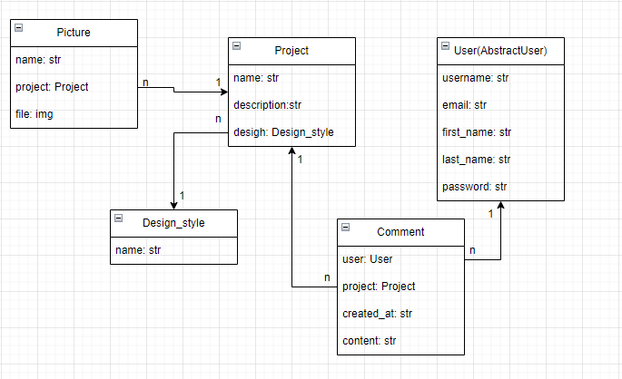

# Boring-interiors - Django Website for interiors design studio

Boring Interiors is a web application built with Django that allows users to browse interior projects, get inspired by them, contact interior studios, or leave comments on any project.


## Check it out!

[Boring-interiors project deployed to Render](https://boring-interiors.onrender.com/)

## Features

- **User Authentication**: Log in/Log out from website.
- **Browse all projects with different styles**: View and inspire our collection of our projects.
- **Filter projects by proper style**: Choose one of the corresponding design styles and focus on it.
- **Comments section**: Feel free to leave a comment in the corresponding section below.
- **Admin Panel**: A custom admin panel for managing design styles, all projects, users and create/update project's.

## Getting Started

### Prerequisites

- Python (>= 3.7)
- Django (>= 4.2.5)
- PostgreSQL (or your choice of database)

### Installation

1. **Clone the Repository**:

```shell
git clone https://github.com/lgSilay/boring-interiors/
cd boring-interiors
python -m venv venv
source venv/bin/activate  # On Windows use `venv\Scripts\activate`
pip install -r requirements.txt
Update the DATABASES setting in settings.py with your database configurations.
python manage.py migrate
python manage.py runserver
```

### DB relations


### User credentials for login

- User: TestUser
- Password: TestUser123